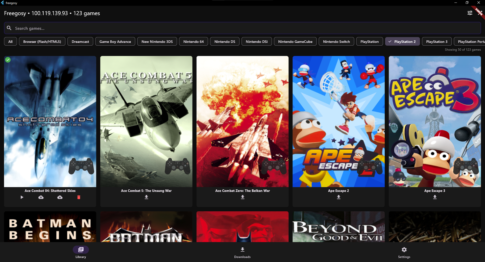
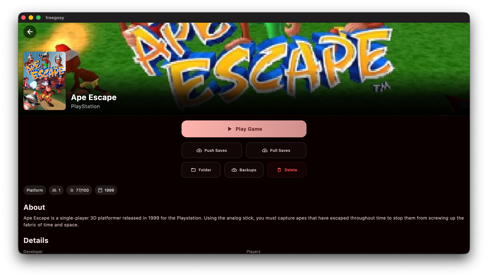

# Freegosy

A cross-platform Flutter app for browsing your RomM library, downloading ROMs, and launching games directly in emulators—all from one intuitive interface.

*The main menu showcasing the intuitive game card interface.*

*Click above to watch the Freegosy feature walkthrough.*

*Detailed game view with metadata, screenshots, and quick actions.*

## Background & Vision
Freegosy (Free as in "Free for all OS") is the successor to [**Wingosy**](https://github.com/abduznik/Wingosy-Launcher). While Wingosy was focused on Windows, Freegosy is built from the ground up using **Flutter** to provide a unified frontend for all major platforms. 

The original inspiration for these projects was [**Argosy**](https://github.com/rommapp/argosy-launcher), the native Android app for RomM built in Kotlin. Freegosy aims to bring that same native experience to desktop and beyond, ensuring a seamless, ease-of-use interface for accessing your RomM collection on any device.

# Support the Project

Freegosy is a solo passion project — built and maintained in my spare time, with AI tools I pay for out of pocket. If it saves you time or makes your RomM setup better, a small contribution genuinely helps keep it going.

No pressure at all — the app is and will always be free.

## Current Features (v0.2.x)

- **Native Multi-Platform Support**: Robust implementation for **macOS** (ARM64/Intel) and **Windows**, with deep integration for local file systems.
- **RomM Integration**: 
    - Browse and filter your entire library with server-side pagination (50 games at a time).
    - Download ROMs directly via HTTP with real-time progress tracking.
    - **New**: Personal game properties support (rating, status, completion).
- **Advanced Emulator Management**: 
    - Download, update, and uninstall emulators directly from Settings.
    - Automatic extraction of `.zip`, `.7z`, `.dmg`, `.tar.gz`, and `.tar.xz`.
    - Smart `.app` bundle detection and canonical renaming on macOS.
- **Save Sync**: Bidirectional local-to-cloud save synchronization with RomM, featuring cross-platform path resolution and automated backups.
- **Refined UI/UX**:
    - **Game Cards**: Visual-first interface with detailed metadata and screenshots.
    - **Recently Played**: Quick access to your latest games.
    - **Multi-Disc Support**: Integrated picker for games with multiple files.
    - **Centralized Error Handling**: Improved stability with user-friendly notifications.

## Roadmap: Version 0.3.0 (Coming Soon)

- **BIOS Management**: Ability to fetch and download BIOS files directly from RomM and automatically place them in the correct directory for each emulator.
- **Linux Support (Beta)**: Starting with a skeleton/shell for **Steam Deck (EmuDeck)** integration.
- **Enhanced macOS Support**: Further refinements to the native implementation and bug fixes.
- **Save Sync Improvements**: Polishing the push/pull logic for edge cases.
- **Better Screenshot Handling**: Improved performance and display of game gallery images.
- **API v4.8.2 Readiness**: Shells are already in place for updating game data like completion status and progression bars; full functionality will be unlocked with the RomM 4.8.2 API release.

## Calling All Testers!
I am currently searching for testers on **macOS** and **Windows** to help polish the experience. 

- **Future Plans**: Steam Deck/Linux support is next, followed by **Android** for a truly unified app.
- **Get Involved**: If you're interested in testing an early release, reach out via GitHub or join the community discussions.

## About RomM

Freegosy is built to complement [RomM](https://github.com/rommapp/romm), a modern ROM manager. It connects to your RomM instance to provide a lightweight, portable way to access and play your games.
