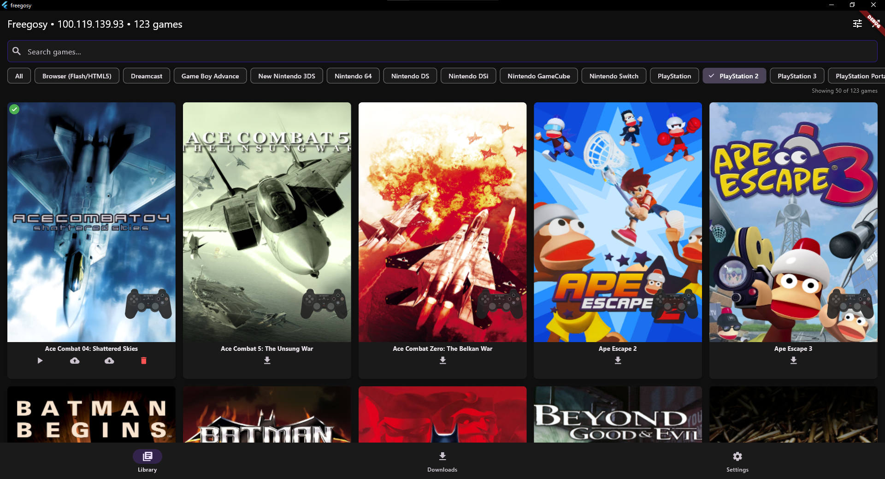
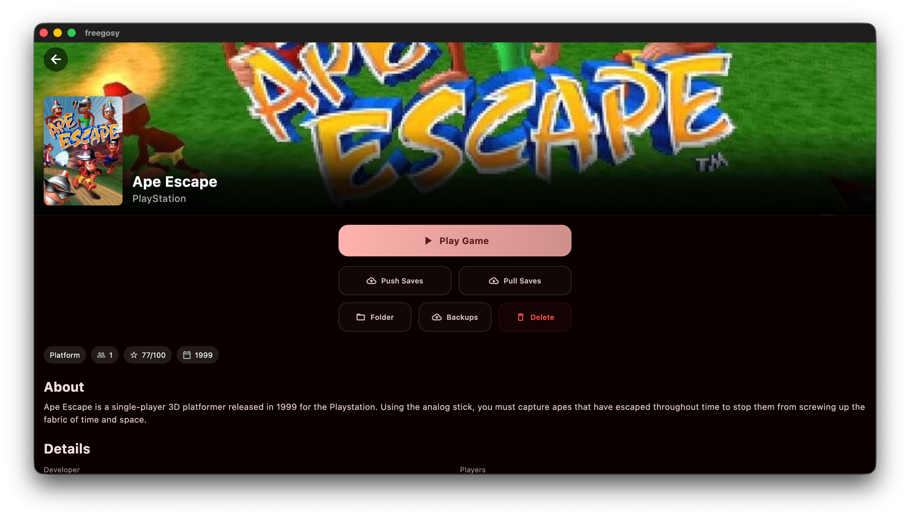
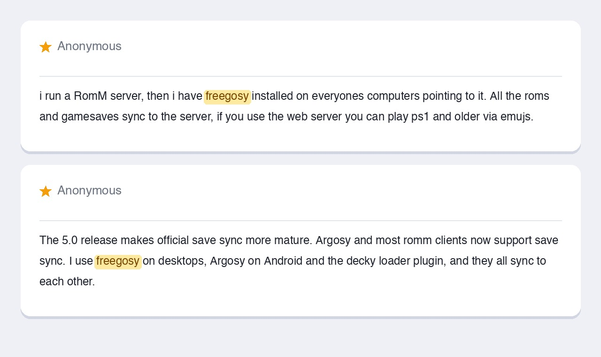

## Support This Project

> **All projects made with passion** 💙

[](https://github.com/sponsors/abduznik)

# Freegosy

A cross-platform Flutter app for browsing your RomM library, downloading ROMs, and launching games directly in emulators—all from one intuitive interface.

[**Watch the Feature Walkthrough on YouTube**](https://youtu.be/SE5BoFoA700)

**Join our [Discord community](https://discord.gg/PEBUzGNMaw)** to chat, get help, and be the first to test new releases!


*The main menu showcasing the intuitive game card interface.*


*Detailed game view with metadata, screenshots, and quick actions.*

## Background & Vision
Freegosy (Free as in "Free for all OS") is the successor to [**Wingosy**](https://github.com/abduznik/Wingosy-Launcher). While Wingosy was focused on Windows, Freegosy is built from the ground up using **Flutter** to provide a unified frontend for all major platforms. 

The original inspiration for these projects was [**Argosy**](https://github.com/rommapp/argosy-launcher), the native Android app for RomM built in Kotlin. Freegosy aims to bring that same native experience to desktop and beyond, ensuring a seamless, ease-of-use interface for accessing your RomM collection on any device.

# Support the Project

Freegosy is a solo passion project — built and maintained in my spare time, with AI tools I pay for out of pocket. If it saves you time or makes your RomM setup better, a small contribution genuinely helps keep it going.

[](https://github.com/sponsors/abduznik)

No pressure at all — the app is and will always be free.

## Current Features (v0.5.10)

- **Native Multi-Platform Support**: Full support for **macOS** (ARM64/Intel), **Windows**, and **Linux** (including **Steam Deck/EmuDeck** and **RetroDECK** integration).
- **Enhanced Offline Mode**: Persistent metadata caching for browsing and launching your collection without a connection.
- **RomM Integration**:
    - Browse and filter your entire library with server-side pagination.
    - Instant "Downloaded" games filter with background deep collection scanning.
    - Download ROMs directly via HTTP with real-time progress tracking.
    - Personal game properties support (rating, status, completion).
    - **New**: Full RomM 4.9 support — per-device save sync, play session tracking.
- **Advanced Emulator Management**:
    - Download, update, and uninstall emulators directly from Settings.
    - Automatic extraction of `.zip`, `.7z`, `.dmg`, `.tar.gz`, `.tar.xz`, and `.AppImage`.
    - Smart binary detection and canonical naming across all platforms.
    - Dynamic architecture selection for RPCS3 on macOS (ARM64 vs x64).
    - Linux Environment Strategies (Default, EmuDeck, RetroDECK) with automatic path detection.
- **RetroArch Core Management**:
    - 197 libretro cores with searchable platform browser.
    - Per-platform default core selection (Settings → RetroArch Cores).
    - Per-game core override (launch-time picker or long-press in Platform Manager).
    - Platform Manager: choose between standalone emulator or RetroArch core per platform.
    - Favorite cores pinning for quick access.
- **BIOS Management**: Fetch and download BIOS files directly from RomM and automatically place them in the correct directory for each emulator.
- **Save Sync**:
    - Bidirectional local-to-cloud save synchronization with RomM.
    - Local Backup History (create instant restore points before experimenting).
    - Serial Background Sync Queue (offline backups silently push to RomM automatically when you reconnect).
    - Optimized for EmuDeck's platform-specific save structure.
    - **New**: Per-device save isolation on RomM 4.9+ (saves tagged to your device, no cross-device conflicts).
    - **New**: Play session tracking — game sessions automatically recorded to RomM 4.9+.
    - **New**: PCSX2 per-game folder saves (`saves/{Serial}/`) supported alongside legacy memcards.
    - **New**: Dolphin GameCube saves now correctly upload a single `.gci` (no more backup dumps or unrelated games).
    - **New**: All strategies respect a 2-second session-start grace window to prevent missing saves written at launch.
- **Refined UI/UX**:
    - **Visual-First Grid**: Interactive game cards with detailed metadata.
    - **Recently Played**: Quick access to your latest games.
    - **Screenshot Gallery**: Interactive, zoomable screenshot viewer.
    - **Multi-Disc Support**: Integrated picker for multi-file games.
- **Controller Support**:
    - **New**: Polarity-encoded axis keys (`left_x+` / `left_x-`) for full analog stick and hat switch mapping.
    - **New**: SDL GameControllerDB hat switch format (`h0.1`, `h0.2`, etc.) fully parsed for auto-mapping.
    - **New**: Reset controller mapping button to clear a broken custom profile.
    - **New**: Save button disabled when sniff wizard produces an empty mapping.

## Headless Mode (early preview)

Freegosy can run without opening a window — useful for scripting a launch/sync check, or driving it from an agent/CI. This is a new, actively-tested feature; feedback welcome.

```
freegosy.exe --headless list [--search=TERM] [--platform=SLUG_OR_ID] [--limit=N] [--json]
freegosy.exe --headless download (--game-id=ID | --name=TERM) [--all-files] [--json]
freegosy.exe --headless launch (--game-id=ID | --name=TERM) [--emulator=ID] [--core=ID] [--timeout=SECONDS] [--json]
freegosy.exe --headless interactive
freegosy.exe --headless                 (same as interactive)
```

- `list`/`download`/`launch` accept `--game-id` (RomM game ID) or `--name` (best match by title; ambiguous matches are listed instead of guessing).
- `launch` waits for the emulator to exit, then runs the same save-push/backup pipeline as launching from the UI, and reports the result (pass/fail, sync status, backup path) as JSON with `--json` or human-readable text otherwise.
- `--timeout` force-terminates the emulator after N seconds instead of waiting for you to close it — handy for automated checks. Some emulators (e.g. MelonDS) manage the process internally until it exits, so the timeout only takes effect once a process handle becomes available.
- Credentials are reused from the account already configured in the app (server URL, username, password/API key/token) — log in once via the normal UI first.
- Exit codes: `0` success, `1` launch/sync failed, `2` invalid arguments or game/config not found.

## Platform / Emulator Status

| Emulator | Status | Notes |
|---|---|---|
| **RetroArch** | 🟢 Full | 197 cores supported. Per-platform core selection, per-game core override, searchable core browser. Tested: GBA (mGBA), SNES (Snes9x), NES (FCEUmm), N64 (mupen64Plus), NDS (melonDS), Dreamcast (Flycast), Mega Drive (Genesis Plus GX), PSP (PPSSPP), PS1 (PCSX ReARMed), Saturn (Mednafen), Arcade (FBNeo), DOS (DOSBox Pure). |
| **DuckStation** | 🟢 Full | PS1 `.mcd` memory card saves fully synced. |
| **PPSSPP** | 🟢 Full | PSP save data directory fully synced. |
| **Ryujinx** | 🟢 Full | Switch save directory fully synced (configurable Title ID mapping). |
| **Eden** | 🟢 Full | Switch save directory fully synced (configurable Title ID + profile). |
| **PCSX2** | 🟢 Full | PS2 per-game folder saves (`saves/{Serial}/`) and legacy `.mcd` memcards both synced. |
| **mGBA** | 🟢 Full | GBA/GBC/GB `.sav`/`.srm` fully synced (standalone, outside RetroArch). |
| **MelonDS** | 🟡 Partial | NDS save files synced (limited testing). |
| **Dolphin** | 🟡 Partial | GC/Wii save files synced. |
| **Cemu** | 🟡 Partial | Wii U — confirmed working on Windows, needs macOS/Linux testing. |
| **Azahar** | 🟢 Full | 3DS — confirmed working by [@Ramza2k](https://github.com/Ramza2k). |
| **RPCS3** | 🟡 Partial | PS3 — confirmed working on Windows, needs macOS/Linux testing. |
| **Xenia** | 🟡 Partial | Xbox 360 — confirmed working on Windows, needs macOS/Linux testing. |
| **Ares** | 🟡 Partial | Multi-system (GBA, SNES, N64, Genesis, PS1, MSX, etc.). PlayStation confirmed working on Windows — Ares bundles the memory card together with save-state files in a per-game `.zip`, now correctly unpacked/repacked on push and pull. Other systems still need real-world testing. |
| **Windows Native** | 🟡 Partial | PC games — confirmed working on Windows. |

**Per-OS Notes:**
- **macOS** (ARM64/Intel): RetroArch, DuckStation, Ryujinx, Eden, mGBA all verified. App bundle path resolution handles `.app` package structure. Ares save path: `~/Library/Application Support/ares/`.
- **Windows**: Same emulator support. DuckStation portable mode auto-configured via `portable.txt`. RetroArch config file resolution via `APPDATA`. Ares portable (settings next to exe) or `%LOCALAPPDATA%/ares/`.
- **Linux** (Steam Deck / EmuDeck / RetroDECK): RetroArch, DuckStation, Dolphin, PPSSPP, PCSX2 all supported via EmuDeck/RetroDECK save structure presets. Ares save path: `~/.local/share/ares/`.

> Help wanted — if you're using an emulator marked 🔴 or 🟡 and can confirm compatibility, please report your experience!

## Calling All Testers!
I am currently searching for testers on **macOS**, **Windows**, and **Linux (Steam Deck)** to help polish the experience. 

- **Future Plans**: **Android** support is next for a truly unified app experience.
- **Get Involved**: If you're interested in testing an early release, reach out via GitHub or join the community discussions.

## Community Reviews



## About RomM

Freegosy is built to complement [RomM](https://github.com/rommapp/romm), a modern ROM manager. It connects to your RomM instance to provide a lightweight, portable way to access and play your games.

## Installation

### Nix / NixOS

Freegosy provides a flake for Nix-based systems. Add it as an input in your flake:

```nix
{
  inputs = {
    nixpkgs.url = "github:NixOS/nixpkgs/nixos-unstable";
    freegosy.url = "github:abduznik/Freegosy";
  };

  outputs = { self, nixpkgs, freegosy }: {
    # Use in your configuration
  };
}
```

Or run directly without installing:

```bash
nix run github:abduznik/Freegosy
```

### Other Platforms

Download the latest release for your platform from the [Releases page](https://github.com/abduznik/Freegosy/releases):

- **Windows**: `.exe` installer
- **macOS**: `.dmg` disk image
- **Linux**: AppImage (`.AppImage`) or tarball (`.tar.gz`)

> **Windows Defender false positive (v0.5.10 and later)**
>
> Windows Defender may flag `freegosy.exe` as `Wacatac.B!ml`. **This is a false positive.** Freegosy is fully open source — you can audit every line of code in this repository. The warning is triggered because the executable is not code-signed and new release hashes start with zero download history, which causes Microsoft's ML model to flag them automatically. The detection clears on its own as more users download the release. If you want to verify the file before running it, check that the SHA-256 hash matches the one listed on the [Releases page](https://github.com/abduznik/Freegosy/releases).
